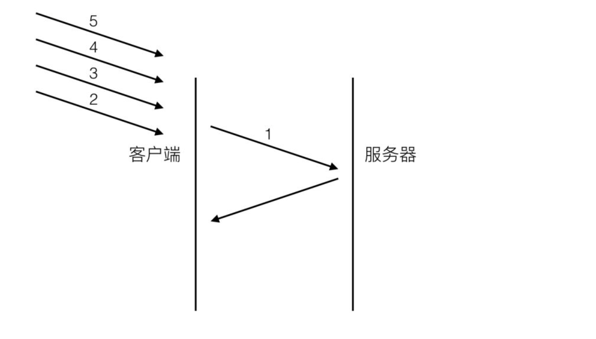
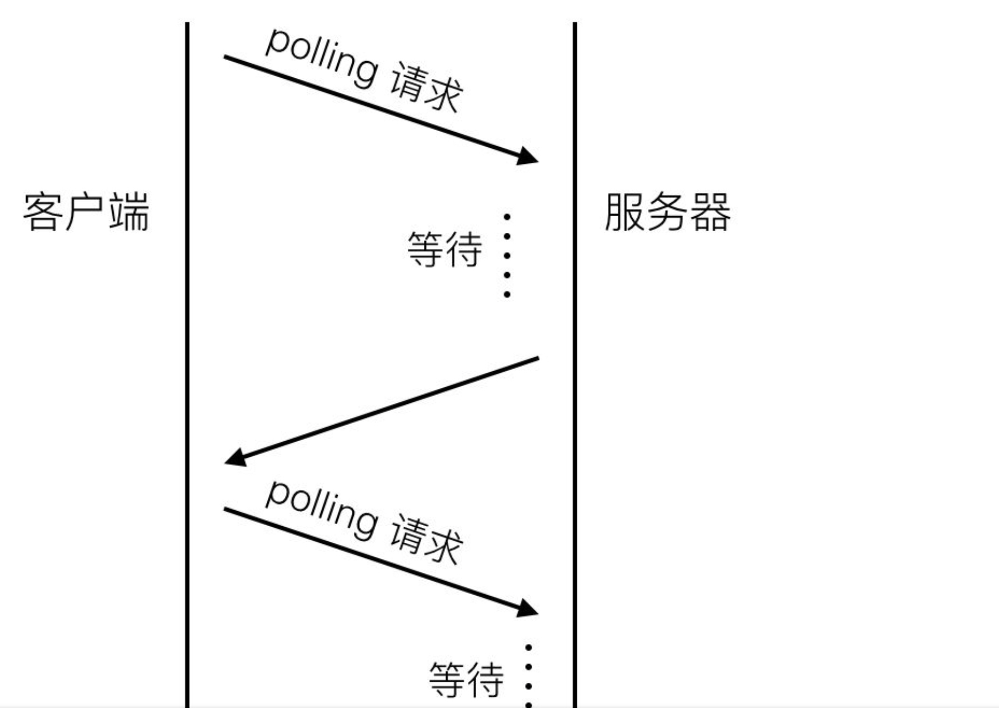
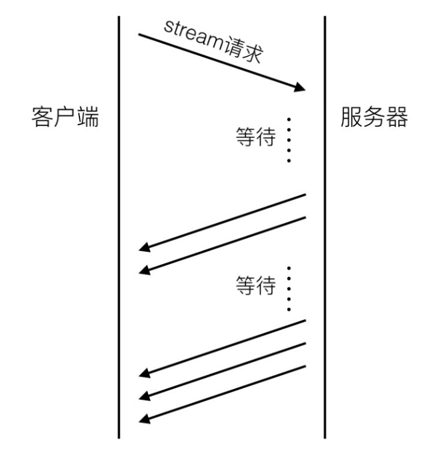
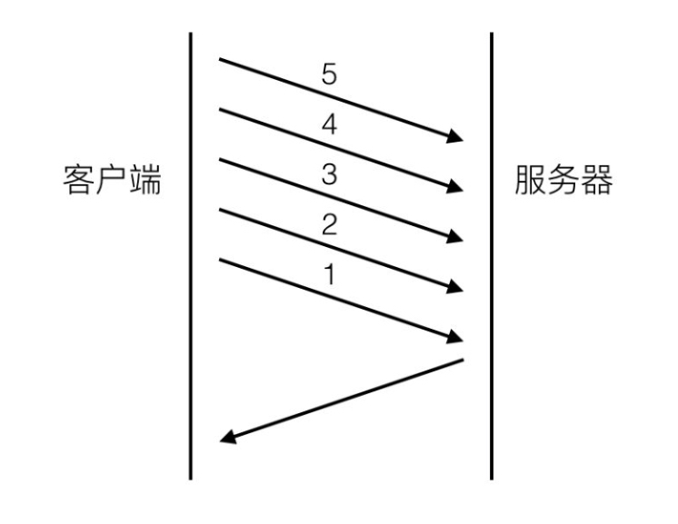
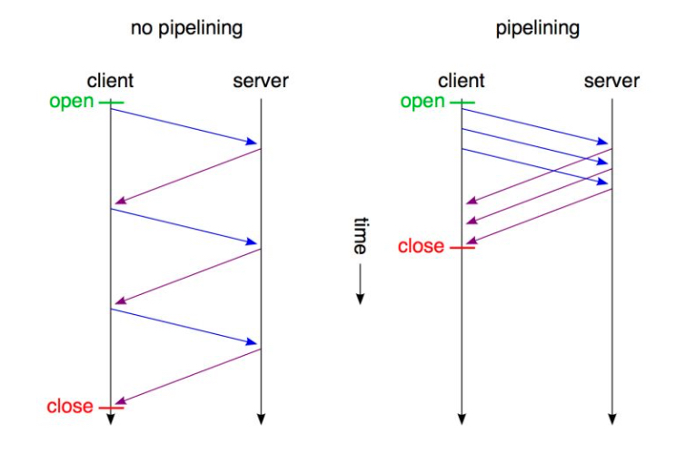

##HTTP 2.0

###简述

* 前世
 * Http 2.0的前世是 Http 1.0 和 Http 1.1的两个版本
 
  虽然之前只差两个版本，但是协议的差距很大。Http 1.0的协议有60页，1.1的协议文 档膨胀到176页。但是尽管诞生2.0，1.0和1.1的版本也会存在相当的一段时间。需要逐步替换升级调。
 
 * **HTTP站在TCP之上**
 
 理解HTTP协议一定要对TCP有一定基础。TCP协议作为传输层协议离应用层并不远。**HTTP协议的瓶颈及其优化技巧都是基于TCP协议本身的特性**。
 
 1. 比如TCP建立连接时三次握手有1.5个RTT(round-trip time)的延迟，为了避免每次请求都经历握手带来的延迟，应用层会选择不同策略的http长连接方案。
 2. TCP在建立连接的初期有慢启动(slow start)的特性，所以连接的重用总是比新建连接性能要好。
 
 * HTTP应用场景
 
 HTTP诞生之初主要用于web端内容获取。那时候内容不丰富，排版不精美，用户交互场景基础没有。简单的获取网页内容，HTTP表现的还不错。但随着web2.0的诞生，更多的内容，精美排版，复杂的交互被引入。打开一个网站首页，加载数据和请求个数都不断增加。另一个移动端的app，不同性质的app对http的使用差异很大。电商类的app，首页请求多大10多个，微信类IM，http请求可能仅限于语音和图片文件的下载。
 
 * **因为延迟，所以很慢**
 
 影响网络请求的两个主要因素：**带宽和延迟**。不过今天的网络基础建设已经使带宽得到了极大的提升，大部分时候都是**延迟**在影响。http1.0被抱怨最多的就是**连接无法复用，head of line blocking**。理解的前提：客户端是根据域名来向服务器建立连接，PC端游览器会针对单个域名的server同时建立6~8个连接，手机端的连接数则一般控制在4~6个。显示连接数不是越多越好，资源开销和整体延迟都会随之增大。
 
 1. **连接无法复用**  会导致每次请求都经历三次握手和慢启动。三次握手在高延迟的场景下影响比较明显，慢启动则对文件类大请求影响较大。
 2. **head of line blocking** 会导致带宽无法被充分利用，以及后续健康请求的阻塞。
假设有5个请求，在第一个请求没有收到回复之前，后续从应用层发出的请求只能排队，请求2，3，4，5只能等待请求1的response回来之后才能逐个发出。网络顺畅的时候性能影响不大，一旦请求1的request因为什么原因没有抵达服务器，或者response因为网络阻塞没有及时返回，影响的就是后续所有的请求，问题就比较严重。
 
 * **解决连接无法复用**
 
 http 1.0的协议头里面可以设置Connection:Keep-Alive。在header里设置Keep-Alive可以在一定时间内复用连接，具体复用时间的长短由服务器控制，一般在15s左右。
 到http 1.1之后，Connection的默认值就是Keep-Alive，如果要关闭连接需要显示的设置Connection：close。一段时间对于PC端游览器体验帮助大，因为大部分请求集中在一小段时间内，但对于移动app来说，成效不大，app端的请求比较分散，时间跨度较大。所以移动端app一般从应用层寻求其他解决方案。长连接或者伪长连接：
 
 1. **方案一：基于tcp的长链接**
 
 现在越来越多的app会建立一条自己的长链接通道，通道的实现是基于tcp协议的。基于tcp的socket编程技术难度相对复杂很多，需要自己定制协议，但带来的回报很大。信息的上报和推送变得更及时，在请求量爆发的时间点还能减轻服务器压力。（http的短链接模式会频繁的创建和销毁连接）。不止IM app有，淘宝类电商也有自己的专属连接通道。现在业界有不少成熟方案，google的**protobuf**就是其中之一。
 
 2. **方案二：http long-polling**
 
 long-polling可以用下图表示：
 客户端在初始状态发送一个polling请求到服务器，服务器不会马上返回业务数据，而是等待有新的业务数据产生时候再返回。所以连接一直被保持，一旦结束马上又发起一个新的polling请求，如此反复，一直有一个连接被保持。服务器有新的内容产生时候，并不需要等待客户端建立新连接。**做法虽然简单，但有些难题需要攻克才能实现稳定可靠的业务框架**
 
 * 和传统的http短连接相比，长连接会在用户增长的时候极大增加服务器压力。
 * 移动端网络环境复杂，像WiFi和4g网络切换，进电梯导致网络临时断掉等，需要考虑怎么健康的重连通道。
 * 这种polling的稳定性不好，需要做好数据可靠性保证，比如重发和ack机制。
 * polling的response有可能会被中间代理cache住，要处理好业务数据的过期机制。
 * 缺点：每次心情求会带上重复的header信息，还有数据通道是单向的，主动权在server这边，客户端有新的业务请求无法及时传送。
 
  3. **方案三：http streaming**
  
  http streaming流程大致如下：
  
  通long-polling不同的是，sever并不会结束初始的streaming请求，而是通过持续的通道返回最新的业务数据，显示这个数据通道也是单向的。streaming通过在server response的头部增加"Transfer Encoding: chunked"来告诉客户端后续还会有新的数据到来。
  
  除此之外还有几个缺陷：
  
  * 有些代理服务器会等待服务器的response结束之后才会将结果推送到请求客户端，对于streaming这种永远不会结束的方式，客户端会一直处于等待response的过程中。
  * 业务数据无法按照请求来做分割，所以客户端每收到一块数据都需要自己做协议解析。

  streaming不会产生重复的header数据。
  
  4. **方案四： web socket**
  
  WebSocket和传统的tcp socket连接相似，也是基于tcp协议，提供双向的数据通道。WebSocket优势在于提供了message的概念，比基于字节流的tcp socket使用更简单，同时又提供了传统的http所缺少的长连接功能。不过WebSocket相对较新，2010年才起草，并不是所有的浏览器都提供了支持。各大浏览器厂商最新的版本都提供了支持。
  
   * **解决head of line blocking**
 
  Head of line blocking 是http 2.0之前最大的问题。健康的请求会被不健康的请求影响，而且出现随机。
  
  1. **pipelining机制**
  
  pipelining的流程图如下：
  
  和之前的图相比，请求2，3，4，5不用等请求1的response返回之后再发出。而是几乎同一时间将resquest发送给服务器。2，3，4，5及之后的的所有请求共用改连接请求节约了等待的时间。极大降低了整体延迟。下面可以清晰看出新机制的改变：
  不过  pipelining同样存在不少的缺点：
  

