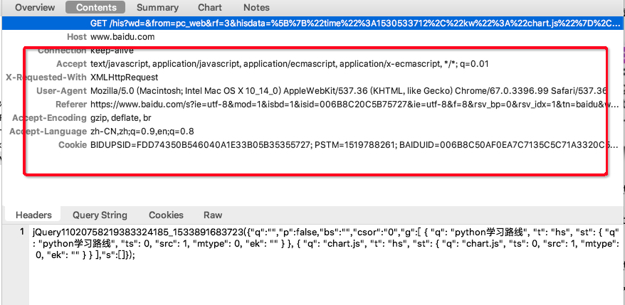
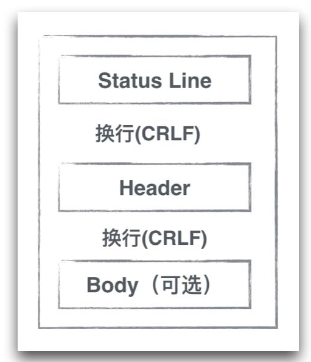

##HTTP基础知识

###简介

1. HTTP全称为HyperText Transfer Protocol.超文本传输协议.
2. 基于文本的网络协议,目前位于OSI体系结构中的应用层.
3. OSI应用层的7层体系如下(TCP/IP的五层协议将应用层,表示层,会话层合并为应用层,变为5层):
4. HTTPS是HTTP协议的安全版本,HTTP协议的数据传输是明文,不安全的.HTTPS使用了SSL/TLS协议进行了加密处理.(RSA加密算法)
5. 不关心传输的细节,主要用来规定客户端和服务端**数据传输格式**.
6. 最初是用来向客户端传输HTML页面的内容.

##HTTP的Request内容分析

先来一张结构图:上面主要分为三部分:
**request line**, **header**和**body**.中间的CRLF为换行符.我们以一个实际的http request的请求为例。[baidu我是例子](https://www.baidu.com/s?ie=utf-8&mod=1&isbd=1&isid=006B8C20C5B75727&ie=utf-8&f=8&rsv_bp=0&rsv_idx=1&tn=baidu&wd=iOS)
后续的分析以此请求为基础。

### Request Line

Request Line的结构为：

```
Request-Line   = Method SP Request-URI SP HTTP-Version CRLF
```

 * Method 是我们常见的请求方法，一般为**POST**和**GET**。
 * SP是一个分隔符，一个字节的大小，值为0x20，对应ASCII码中的空格。
 * Request-URI是我们比较熟悉的，情况下抓包可能分为两种。
	1. [schema]:[host]/[path]?[query]  完整的absoluteURI，包含schema和Host。
	2. /[path]?[query]  abs_path，并没有包含Schema和Host，Host移交到Header中。
* 所以上述的Request-Line的文本展示为：  
```
GET /his?wd=&from=pc_web&rf=3&(参数多省略) HTTP/1.1
```

### Header

本质上是一些文本键值对，典型的例子如下：

* 每个键值对的形式为：key : 空格 Value CRLF.
* 例如上面缺失的Host 就存储在header里面。所有的键值对组合起来构成了完整的header。
* 最后一个键值对后面再跟一个CRLF，等于最后两个CRLF标识header结束。
* 允许开发者添加自己的key，自定义key一般以X开头。比如X-APP-VERSION记录版本号。

### Body

Body里面包含实际的请求数据。 
 
* GET:不存在Body体，Header的最后两个CRLF标志结束。一般请求参数通过Request-URI传递，也就是URI的query string部分。同样是键值对的形式。
* POST:body体一般不为空，body总共有三种形式上传，后面会说。其中部分请求参数可以放在query string中，也可以放在body体中。

##HTTP的Response内容分析

与request的结构类似，将Request Line换成了Status Line。如图：

###Status Line
Status Line的结构为：

```
Status-Line = HTTP-Version SP Status-Code SP Reason-Phrase CRLF
```
这里关键在于Status-Line的记忆，以下列出大概的Status码的记忆：  
 
* 1xx: Informational - Request received, continuing process。 
* 2xx: Success - The action was successfully received, understood, and accepted。 
* 3xx: Redirection - Further action must be taken in order to complete the request。 
* 4xx: Client Error - The request contains bad syntax or cannot be fulfilled。
* 5xx: Server Error - The server failed to fulfill an apparently valid request

###其他Header和Body的信息应该和Request所带的数据一样。

##其他的小知识

###可以用来携带数据的部分

至此，我们分析一下http请求，哪些可以用来携带业务数据。 
  
* Request Line : 标准的GET请求用来传递数据的位置，用Query String格式存在URI当中。一些游览器和FrameWork对于Query String长度会有一定限制，所以不适合传输大数据。
* Header : 可以选择协议中标准的header key，也可以通过自定义key，比如上面提到的X-APP_VERSION。
* Body : POST	请求传输数据的地方(也可以放在Request Line中)，根据Header中Content-Type值，以不同的形式将数据保存在body体中。

###一些解析隐藏细节

HTTP是基于**文本解析**的协议，上面提到的空格(0x20)，换行(0x0D0A)都是HTTP用来做文本解析的符号。  
大体的流程是：当我们从TCP层拿到应用层的buffer之后，以CLRF(\r\n)为分隔符，将整个buffer分成若干行，第一行使我们的Requrst Line；之后每一行代表一个Header，如果碰到连续的两个CLRF，则表示header结束；如果Method=POST，读取Header中的Content-Length值，根据这个值读取固定长度的body体。这样就完成了上述三个主要部分的读取。当然上面是简化流程，时机解析场景更多一些。

###深入Request Line解析
我们从TCP层拿到的实际是一个**字节流**。将字节流解析成能够阅读交流形式，需要将字节码进行编码和解码。Request Line使用的编码格式是US-ASCII，是ASCII码的一种。通过ASCII码还原之后，可以得到正确的结果。URI的解析有自己的一套规范。  
我们平时特别要注意的是**query string**部分。平时query string塞入自己的数据，这些数据可能是任意形式的字节流，而Request Line和URI的解析都依赖与一些特殊字符做分割，比如空格，/，?等等。为了能保证正确，安全的解析整个Request Line和URI，需要对**query string**字节流进一步编码约束，只允许出现安全的ASCII码，这就是需要URLEncode的原因。(**例如传入的参数有另外一个url，或者@，或者汉字，这样识别不了，相当于将不安全的ASCII码转化为安全的，全世界都可以识别的一种方式**)

* UrlEncode过程：将字节流的所有字节，对照ASCII码表分为**安全ASCII码**和**不安全的ASCII码**。安全的ASCII码不用处理，不安全的(比如空格0x20)做进一步编码处理，用安全的代替不全的ASCII码。比如空格0x20被编码为%20，由一个ASCII码变成三个ASCII码(%,2,0).对于不属于ASCII码的**中文**来说，先用**UTF-8编码成字节流**，在对照ASCII码做编码。
* UrlEncode的结果：安全解析的需要，但是缺点是Encode那些非ASCII码的时候，一个字节会被encode成3个字节，长度整整是原先的3倍，造成流量浪费。

###深入Header解析

对于Header可以先用CRLF分割成一个个键值对，键值对里面的值，也会有编码要求，但是常用的几个Field，比如Host，User-Agent，使用ASCII码字符已经绰绰有余，一般不会对值进一步Encode。

###深入Body解析
从header中知道Content-Length之后，读取固定长度的字节流既可以完成body的获取，如果解析读取其中的内容并递交给应用层？HTTP协议本身没有对Body中的内容编码做约束，而是交给协议的使用者决定。甚至可以在body里面存放二进制流，对应的content-type为application/octet-stream  

以AFNetworking为例，当向Server发送数据时候，需要和Server约定好所使用的Content-type。看看使用最频繁的集中Content-Type：

```
AFJSONRequestSerializer* jsonSerializer = [AFJSONRequestSerializer serializer];
request = [jsonSerializer requestWithMethod:@"POST" URLString:requestUrl parameters:requestParams error:nil];
```

* multipart/form-data

```
request = [self.requestSerializer multipartFormRequestWithMethod:@"POST" URLString:requestUrl parameters:requestParams constructingBodyWithBlock:nil error:nil];
```

* application/x-www-form-urlencoded

```
request = [self.requestSerializer requestWithMethod:@"POST" URLString:requestUrl parameters:requestParams error:nil];
```

* application/json

```
request = [self.requestSerializer requestBySerializingRequest:request withParameters:requestParams error:nil];
```
如果Request没有设置Content-type的时候，默认是使用的是application/x-www-form-urlencoded。 这里的urlencode和前面request-line中的是一样，只不过要encode的是body里面的内容。

* 那么什么时候用application/x-www-form-urlencoded，什么时候用multipart/form-data？
 * 当使用multipart/form-data时，Content-type的完整值为multipart/form-data; boundary=Boundary+2BBBEA582E48968C。**因为multipart把body分成多个块，多个快依赖于boundary值做分割，所以生成的boundary要足够长，长到在字节流出现重复的概率几乎为0，否则会导致错误的传输**以下是AFNetworking生成Boundary的方法：
 
 ```
 static NSString * AFCreateMultipartFormBoundary() {
    return [NSString stringWithFormat:@"Boundary+%08X%08X", arc4random(), arc4random()];
}
 ```
 
 * 下面是使用multipart/form-data分割，body中具体的数据格式：
 
 ```
 Boundary+2BBBEA582E48968C
 Content-Disposition: form-data; name="text1"
 text
 Boundary+2BBBEA582E48968C
 Content-Disposition: form-data; name="text2"
 another text
 ```
 可以看出body中多处出现了Boundary+2BBBEA582E48968C和Content-Dispostion，这是用来表示分割body的，body的内容不能出现和分割值一样的。  
 但是这样会增加body的传输大小。
 
 * 所以传输**大文件**时，使用application/x-www-form-urlencoded，文件长度会变为原来的3倍，所以使用**multipart/form-data**合适。
 * 传输**少量的键值对**，使用multipart/form-data，由于boundary和Content-Dispostion会带来额外流量，显示不划算，所以使用**application/x-www-form-urlencoded**合适。