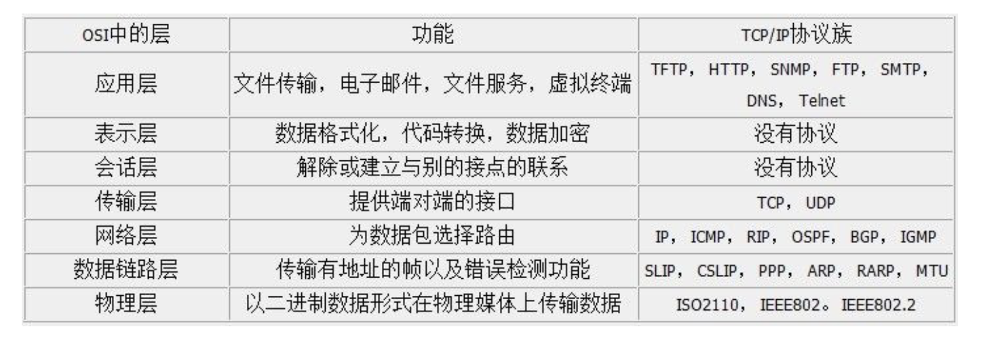
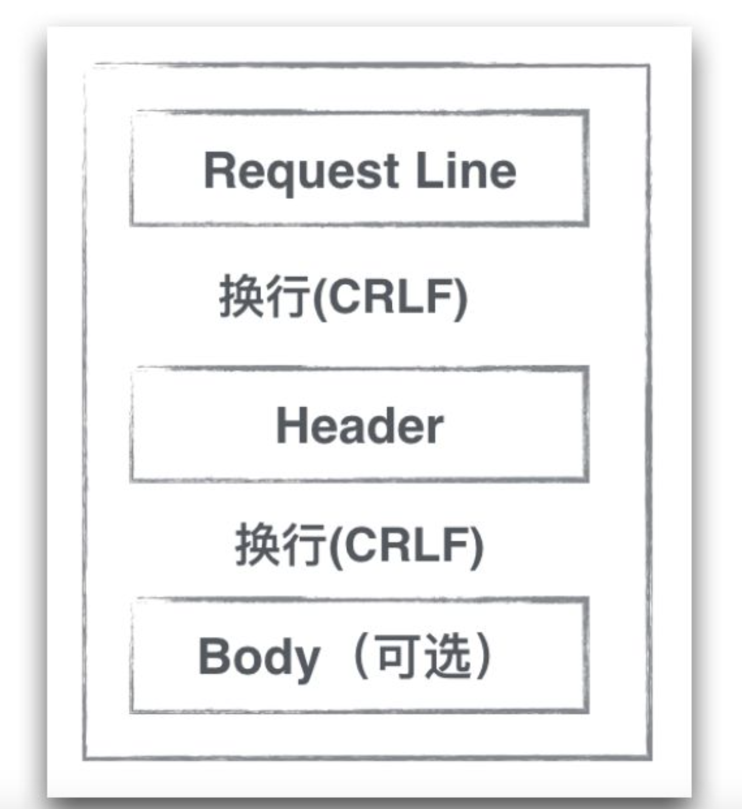

##HTTP基础知识

###简介

1. HTTP全称为HyperText Transfer Protocol.超文本传输协议.
2. 基于文本的网络协议,目前位于OSI体系结构中的应用层.
3. OSI应用层的7层体系如下(TCP/IP的五层协议将应用层,表示层,会话层合并为应用层,变为5层):
4. HTTPS是HTTP协议的安全版本,HTTP协议的数据传输是明文,不安全的.HTTPS使用了SSL/TLS协议进行了加密处理.(RSA加密算法)
5. 不关心传输的细节,主要用来规定客户端和服务端**数据传输格式**.
6. 最初是用来向客户端传输HTML页面的内容.

###HTTP的Request内容分析
先来一张结构图:上面主要分为三部分:
**request line**, **header**和**body**.中间的CRLF为换行符.
